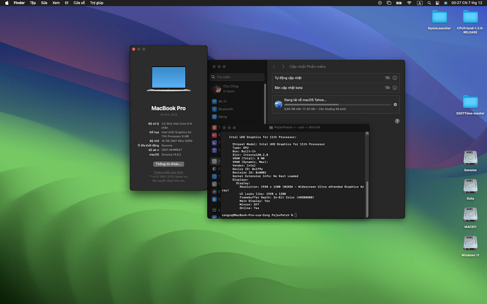

## Dell Precision 5560 hackintosh (Sonoma 14.8.2)

## Overview

This is EFI folder contain everything needed to bootable to OpenCore and running on Dell Precision 5560 laptop.

The parameters below are not the final ones yet.

## Status

| Hardware            | Model                                                     | Status | Comments |
| ------------------- | --------------------------------------------------------- | ------ | -------- |
| CPU                 | 11th Gen Intel(R) Core(TM) i7-11850H @ 2.50GHz (2.50 GHz) | ✅    | |
| iGPU                | Intel UHD Graphics for 11th Processor                     | ❌    | Need eGPU if you want to have Metal Acceleration |
| dGPU                | NVIDIA Quadro T1200                                       | ❌    | |
| Internal Display    | 1920x1200@60Hz                                            | 🔶    | Backlight not working | 
| Trackpad            |                                                           | 🔶    | does not full feature |
| Wi-Fi/Bluetooth     | Intel Wi-Fi 6 AX201 160MHz                                | ✅    | Work with AirportItlwm.kext |
| Thunderbolt/USB-C   |                                                           | ✅    | |
| Internal Speakers   |                                                           | ✅    | |
| Internal Microphone |                                                           | ✅    | |
| Webcam              |                                                           | ✅    | |

| Features | Status |
| -------- | ------ |
| AppStore |  ✅  |
| Sleep    |  ❌  |

## macOS versions that can be installed

- Tahoe (need to be swapped out to a compatible Wi-Fi card)
- Sequoia (need to be swapped out to a compatible Wi-Fi card)
- Sonoma
- Ventura
